# Estudo de Caso - PBB | InovaHub

## Sobre o PBB
É um método e um Canvas que auxilia na elaboração, criação e refinamento de um Product Backlog. Melhorando em pontos específicos como a clareza sobre o produto para todos os envolvidos no desenvolvimento e também na preparação do backlog para que o time comece a se organizar e trabalhar de modo ágil e eficaz.

## Product Backlog Building - InovaHub
A InovaHub é uma rede nacional que conecta e fomenta o ecossistema de inovação e empreendedorismo (incubadoras, startups, aceleradoras, etc.), visando fortalecer a colaboração entre universidades, empresas e governos. A partir das problemáticas de Redundância e Retrabalho, Dados Inconsistentes, Incapacidade de mensurar impacto das iniciativas e Baixa Visibilidade integrada dos dados, a proposta do InovaHub é o desenvolvimento de uma plataforma digital integrada para conectar usuário dos diferentes âmbitos e necessidades, monitorar o progresso das startups de forma unificada e consolidar os dados estratégicos para facilitar a análise das políticas públicas de inovação.

## Personas e Stakeholders
- Gestora de inovação (Mariana)
- Empreendedor de Startup (Lucas)
- Mentor (Sérgio)
- Analista de inovação (Patrícia)
- Investidor-anjo (Renato)
- Gestora pública de empreendedorismo (Cláudia)

## Organização do PBB - Miro

<iframe width="768" height="432" src="https://miro.com/app/live-embed/uXjVJzWTeaU=/?embedMode=view_only_without_ui&moveToViewport=22550,36101,56936,25762&embedId=629343001680" frameborder="0" scrolling="no" allow="fullscreen; clipboard-read; clipboard-write" allowfullscreen></iframe>

### Personas - Atividades e Objetivos

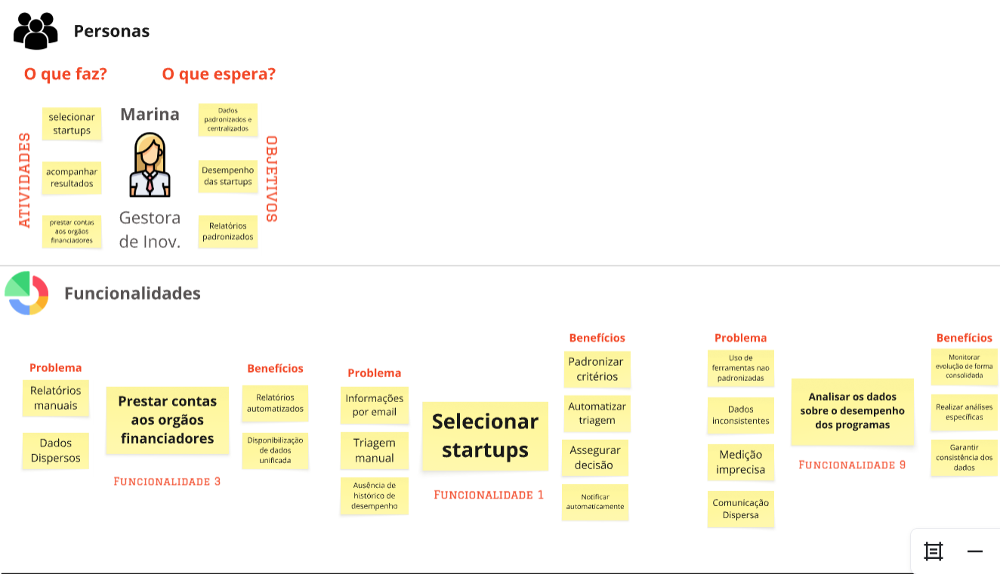  
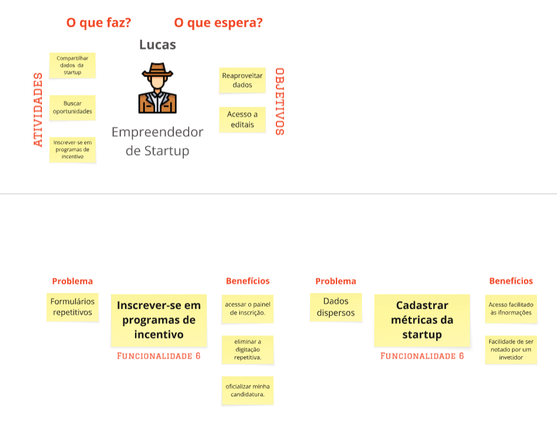  
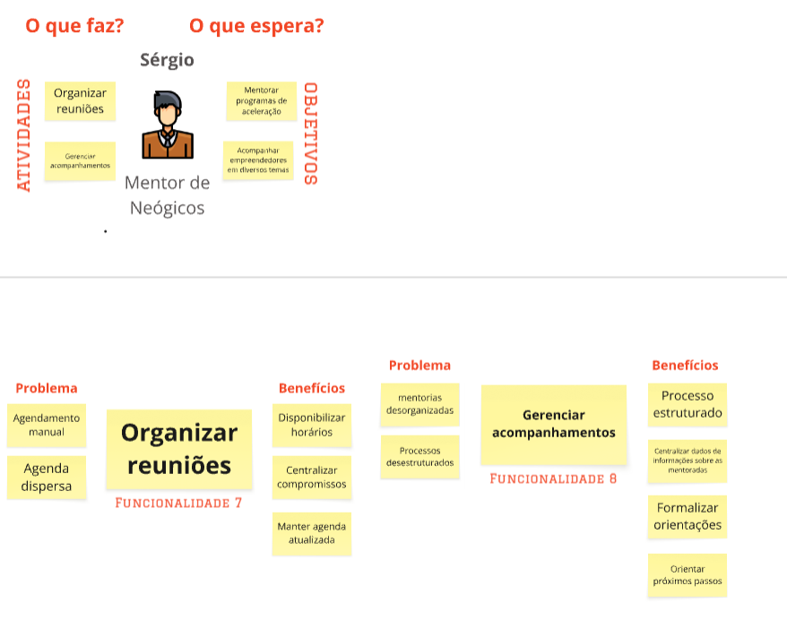  
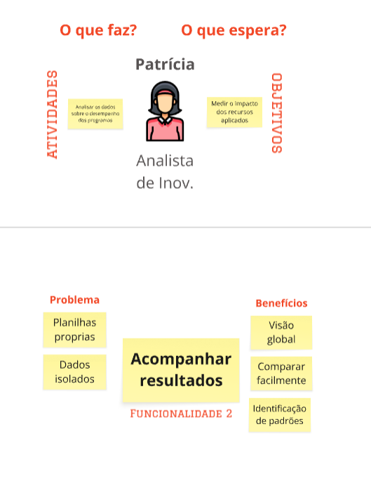  
  

### Problemas e Expectativas

| **Problemas** | **Expectativas** |
| :--- | :--- |
| Dados dispersos | Sistema unificado para a gestão do ecossistema de inovação |
| Ausência de uma visão confiável e unificada dos dados | Integração entre as diferentes personas e as suas atividades |
| Uso Ferramentas não padronizadas | Dados e ferramentas padronizados |
| Organização dos dados não padronizada | Informações facilmente visualizáveis |
| Dificuldade em compartilhar e gerenciar dados de forma integrada | Facilitação na análise para a atuação de cada persona |
| Dificuldade em acompanhar as métricas de desempenho dos programas | Centralização dos dados dos programas em uma plataforma única para análise |
| Dificuldade na analisar o desempenho das startups | Dashboard para analisar métricas e avaliar desempenhos das startups|
| Dificuldade na tomada de decisão para diferentes objetivos | Painel com indicadores confiáveis para mensurar impacto |
| Dificuldade em visualizar o impacto das políticas de incentivo à inovação | Painel unificado entre os resultados gerados pela Gestora de Inov. e Analista de Inovação  |
| Dificuldade em identificar boas oportunidades de investimento | Melhor disposição de dados estratégicos das startups para identificar boas oportunidades de investimento |
| Inscrições e editais são dispostos de forma não organizada | Sistema unificado para a gestão dos editais, mentorias e suas inscrições destes programas |
| Mentorias não tem uma organização ou processo estruturado , dificultando a organização dos mentores | Funcionalidade que auxilia na gestão rápida das reuniões com as startups mentoradas |
| Feedback despadronizado | Dados e ferramenteas padronizados por todos usuários|
| Formulários repetitivos (Redundância e Retrabalho) | Salvamento de dados que são recorrentemente utilizados em todas inscrições aos programas de incentivo |
| Comunicações dispersas | Integração entre as diferentes personas e as suas atividades |
| Triagem manual | Processo digital que auxilia na organização da triagem das candidaturas por meio de categorização das etapas da triagem |    

### Funcionalidades + PBI  

## Mariana

   

## Lucas

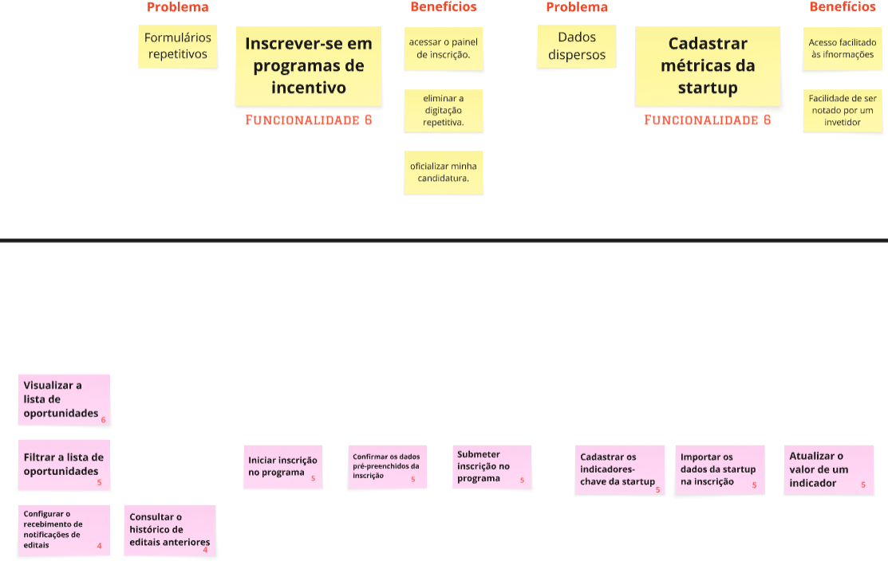  

## Sérgio

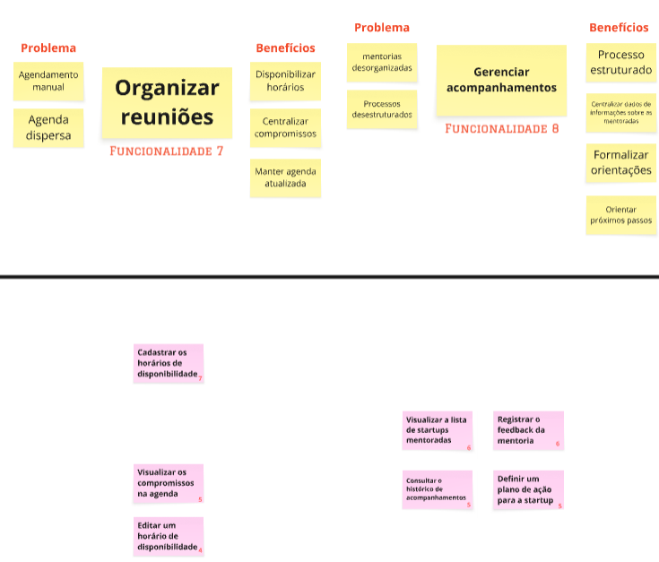

## Patrícia

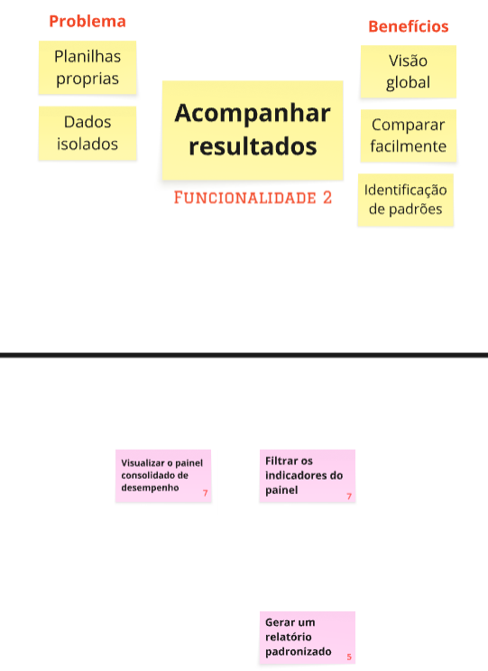  

## Renato

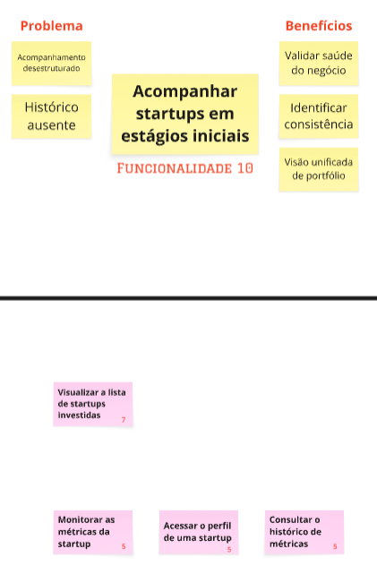  

## Cláudia

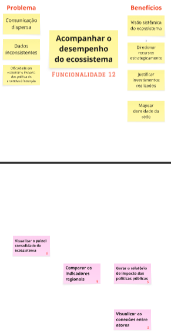

### US's + Critérios 

## Mariana

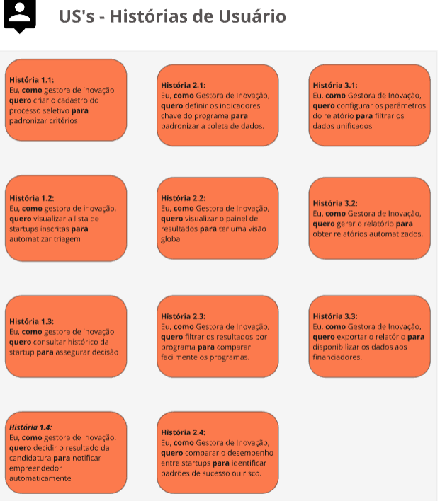
   

## Lucas

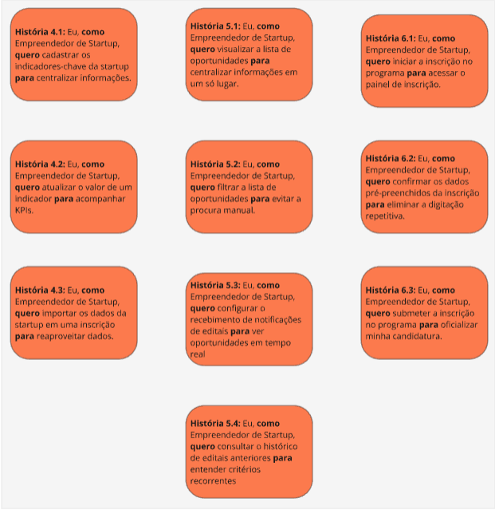
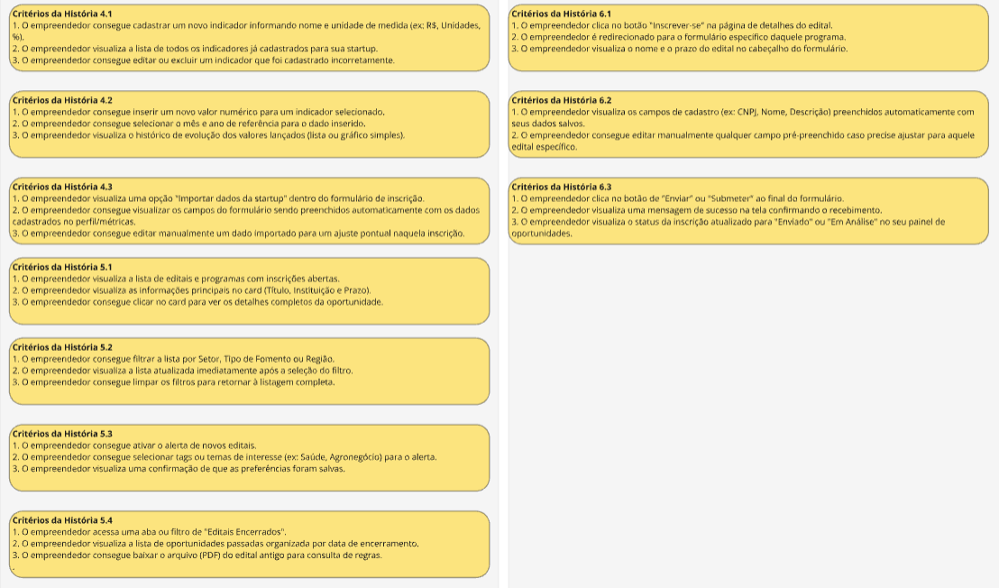   

## Sérgio

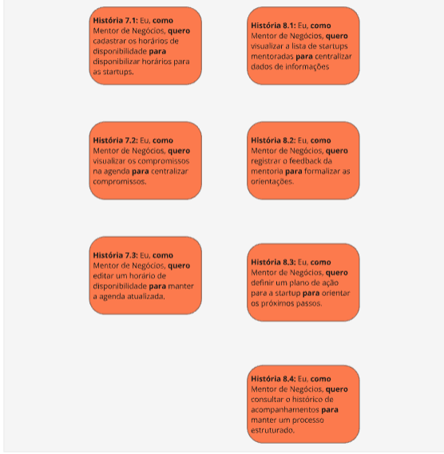
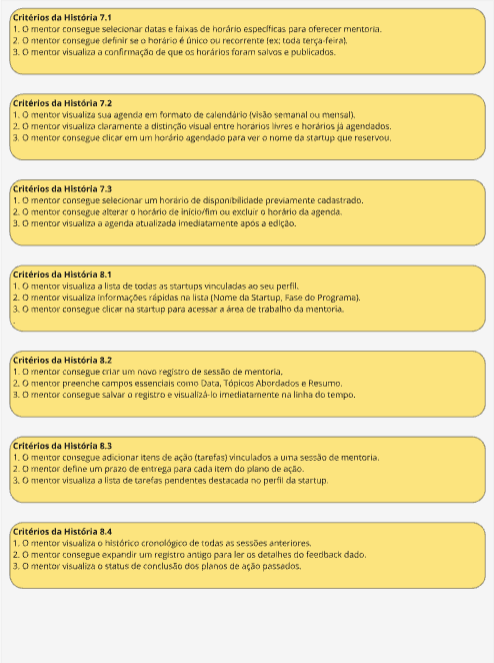

## Patrícia

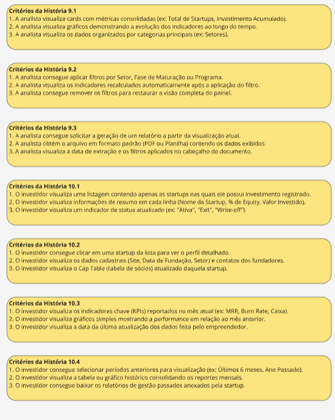

## Renato

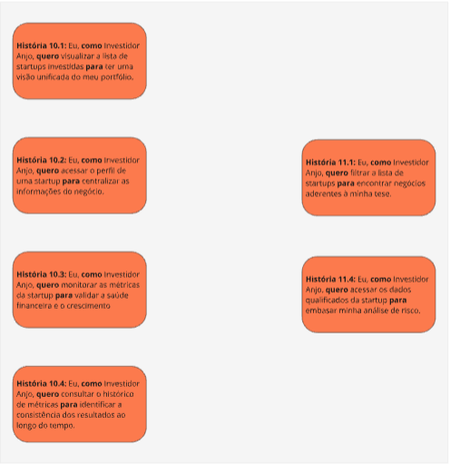
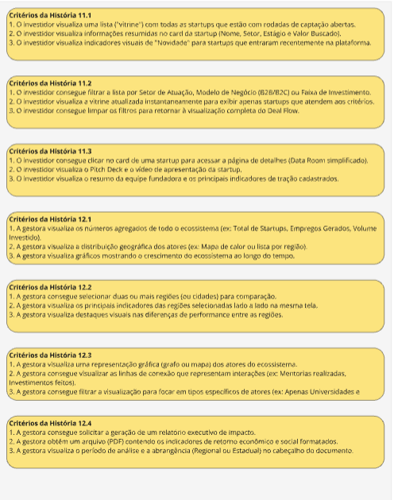  

## Cláudia

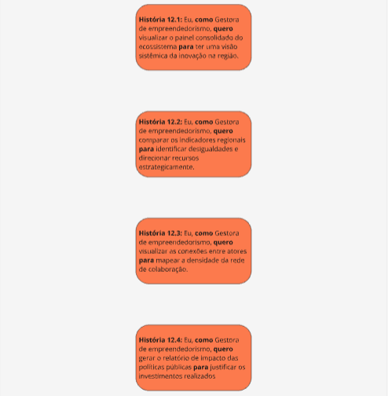
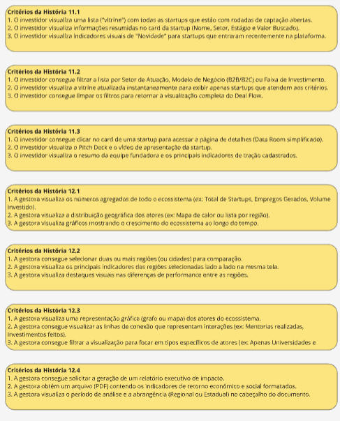

