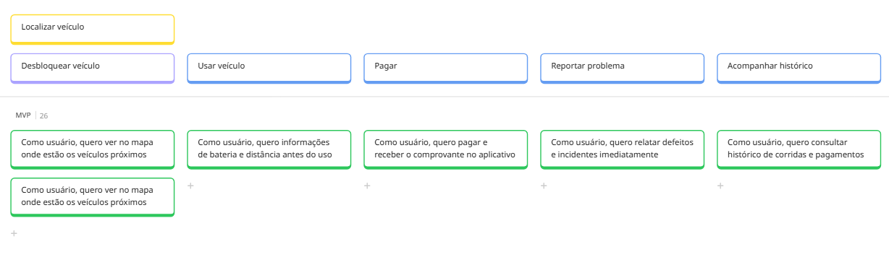
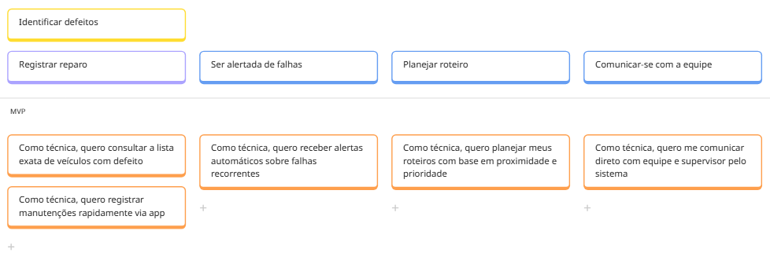
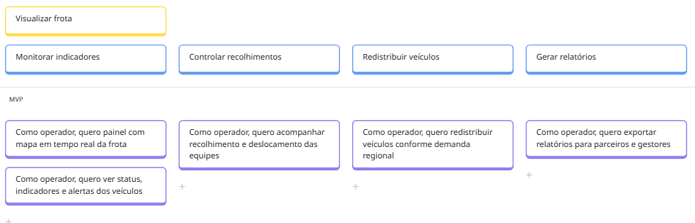
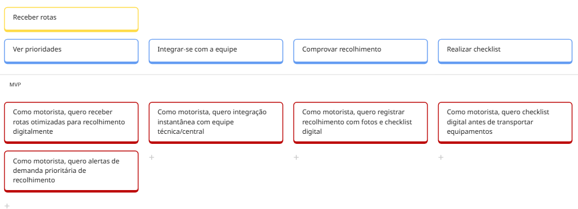

# Estudo de Caso - USM | EcoMove

## Sobre o User Story Mapping
É uma ferramenta para trabalhar com histórias de usuários à medida que são usadas em processos ágeis, como o Backlog do produto estruturado visualmente, permitindo ler os requisitos como uma jornada ou história completa e ter uma compreensão compartilhada de "o que" se quer construir e o "porquê".

## User Story Mapping (USM) - EcoMove
A EcoMove é uma startup fictícia voltada à mobilidade urbana sustentável com a missão de promover o uso de meios de transporte não motorizados, como bicicletas e patinetes elétricos compartilhados, conectando usuários, operadores, técnicos, gestores e prefeituras para formar um ecossistema eficiente e confiável. Os principais usuários são cidadãos urbanos, equipes técnicas de manutenção, operadores de frota, gestores públicos e motoristas de apoio. O principal problema tratado é a fragmentação de informações, ineficiência operacional e experiência ruim para os usuários finais. 

## Personas e Stakeholders
- Usuário urbano (Lucas)
- Técnica de manutenção (Marina)
- Operador de frota (Carlos)
- Gestora municipal de mobilidade (Fernanda)
- Motorista de apoio (Rogério)

## Atividades principais e user stories 

<iframe width="768" height="432" src="https://miro.com/app/live-embed/uXjVJxdHdLc=/?embedMode=view_only_without_ui&moveToViewport=-752,2230,2155,1432&embedId=181717287864" frameborder="0" scrolling="no" allow="fullscreen; clipboard-read; clipboard-write" allowfullscreen></iframe>

[**Link de redirecionamento para o USM no Miro**](https://miro.com/app/board/uXjVJxdHdLc=/?share_link_id=869782407306)

### Usuário urbano (Lucas)
Trabalhador ou estudante que utiliza bicicletas ou patinetes para deslocamentos curtos entre casa, trabalho e transporte público.
 

 
**Foco:** Garantir o básico (encontrar e andar) no MVP, melhorar a confiança na Release 2 e trazer conveniência na Release 3.
| Fase | Jornada | História de Usuário  |
| :--- | :--- | :--- |
| **MVP** | Localizar | Como usuário, quero visualizar veículos no mapa em tempo real, para encontrar uma bicicleta ou patinete disponível nas redondezas. |
| **MVP** | Localizar | Como usuário, quero ver o endereço ou ponto de referência do veículo, para facilitar minha orientação visual ao chegar no local. |
| **MVP** | Desbloquear | Como usuário, quero ver o nível de bateria antes de desbloquear, para evitar pegar um veículo que não aguente meu trajeto. |
| **MVP** | Desbloquear | Como usuário, quero escanear QR Code no veículo, para iniciar o desbloqueio e começar a corrida instantaneamente. |
| **MVP** | Pagar | Como usuário, quero cadastrar cartão e ter cobrança automática, para encerrar a corrida rapidamente sem burocracia. |
| **MVP** | Reportar | Como usuário, quero selecionar opções rápidas de problemas (ex: pneu furado), para reportar falhas em segundos sem digitar muito. |
| **REL 02** | Localizar | Como usuário, quero filtrar por tipo de veículo (bike/patinete), para escolher exatamente o modal que prefiro usar. |
| **REL 02** | Localizar | Como usuário, quero ver status de dano no mapa, para não perder tempo caminhando até um veículo quebrado. |
| **REL 02** | Pagar | Como usuário, quero reembolso automático em falha de desbloqueio, para não ter prejuízo financeiro por erro do sistema. |
| **REL 02** | Reportar | Como usuário, quero anexar fotos e ter número de protocolo, para acompanhar o status da minha reclamação com segurança. |
| **REL 03** | Localizar | Como usuário, quero que o app calcule a rota a pé até o veículo, para chegar até ele pelo caminho mais rápido. |
| **REL 03** | Histórico | Como usuário, quero exportar histórico de pagamentos, para usar como comprovante de despesas ou reembolso. |
| **REL 03** | Histórico | Como usuário, quero avaliar a corrida com nota e comentário, para contribuir com a melhoria do serviço. |

### Técnica de manutenção (Marina)
Responsável por recolher, reparar e redistribuir veículos pela cidade.
 

**Foco:** Sair do papel/planilha no MVP, priorizar o trabalho crítico na Release 2 e ter inteligência de dados na Release 3.
 
| Fase | Jornada | História de Usuário |
| :--- | :--- | :--- |
| **MVP** | Alertas | Como técnica, quero receber alertas de falhas reportadas pelos usuários, para identificar rapidamente quais veículos precisam de atenção. |
| **MVP** | Roteiro | Como técnica, quero ver no mapa a localização exata dos veículos a recolher, para não perder viagem indo a um local vazio. |
| **MVP** | Roteiro | Como técnica, quero visualizar uma lista de veículos organizada em rota, para economizar combustível e tempo de deslocamento. |
| **MVP** | Registro | Como técnica, quero formulário digital padronizado de manutenção, para eliminar o uso de planilhas manuais e evitar erros. |
| **MVP** | Comunicação | Como técnica, quero chat integrado com o Operador de Frota, para formalizar orientações e resolver dúvidas na rua. |
| **REL 02** | Roteiro | Como técnica, quero filtrar chamados por prioridade (crítico vs. moderado), para atacar primeiro os problemas mais urgentes. |
| **REL 02** | Roteiro | Como técnica, quero ser notificada se o veículo for recolhido por outra equipe, para evitar deslocamento desnecessário até lá. |
| **REL 02** | Registro | Como técnica, quero registrar as peças utilizadas no reparo, para ajudar no controle de estoque e custos. |
| **REL 03** | Histórico | Como técnica, quero escanear QR Code para ver histórico do veículo, para diagnosticar problemas recorrentes com precisão. |
| **REL 03** | Roteiro | Como técnica, quero visualizar zonas de atendimento no mapa, para organizar melhor a cobertura da minha equipe. |
| **REL 03** | Segurança | Como técnica, quero acionar botão de emergência no app, para alertar a central imediatamente em situações de risco. |

### Operador de frota (Carlos)
Supervisiona as equipes de manutenção e faz monitoramento da frota em operação.
 

**Foco:** Visão centralizada no MVP, gestão ativa na Release 2 e automação estratégica na Release 3.
 
| Fase | Jornada | História de Usuário |
| :--- | :--- | :--- |
| **MVP** | Monitorar | Como operador, quero um painel com mapa em tempo real da frota, para monitorar o status da operação em uma única tela. |
| **MVP** | Monitorar | Como operador, quero filtrar veículos por status (manutenção, bateria baixa), para focar minha atenção onde é necessário. |
| **MVP** | Gestão | Como operador, quero ver a localização das equipes no mapa, para coordenar os atendimentos logisticamente. |
| **MVP** | Redistribuição | Como operador, quero ver "zonas quentes" e "zonas frias" de demanda, para decidir para onde mover os veículos ociosos. |
| **MVP** | Relatórios | Como operador, quero exportar relatórios básicos de uso, para analisar o desempenho diário da frota. |
| **REL 02** | Alertas | Como operador, quero alertas configuráveis para eventos críticos, para ser avisado passivamente sem vigiar o mapa o tempo todo. |
| **REL 02** | Gestão | Como operador, quero alterar a rota da equipe em tempo real, para atender emergências ou mudanças repentinas. |
| **REL 02** | Relatórios | Como operador, quero customizar os campos dos relatórios, para extrair análises específicas para a diretoria. |
| **REL 03** | Histórico | Como operador, quero ver gráficos de performance histórica, para identificar tendências de comportamento e sazonalidade. |
| **REL 03** | Inteligência | Como operador, quero sugestões automáticas de redistribuição (IA), para otimizar a frota com precisão matemática. |
| **REL 03** | Integração | Como operador, quero integração automática com a Gestora Municipal, para cumprir obrigações regulatórias sem esforço manual. |

### Gestora municipal de mobilidade (Fernanda)

Representa o poder público responsável por regular e acompanhar a operação dos modais de transporte sustentável.

**Foco:** Acesso a dados brutos no MVP, fiscalização visual na Release 2 e integração total de sistemas na Release 3.
 
| Fase | Jornada | História de Usuário |
| :--- | :--- | :--- |
| **MVP** | Dados | Como gestora, quero um portal de dados brutos (API/CSV), para realizar análises independentes sem depender de envio manual. |
| **MVP** | Relatórios | Como gestora, quero relatórios padronizados de viagens e distância, para comprovar quantitativamente o impacto na mobilidade. |
| **MVP** | Comunicação | Como gestora, quero um canal direto de mensagens com os operadores, para enviar notificações oficiais de forma rastreável. |
| **REL 02** | Fiscalização | Como gestora, quero mapas de calor de incidentes e estacionamento, para identificar áreas de risco e ordenar o espaço público. |
| **REL 02** | Compliance | Como gestora, quero painel de status de licenças e cobertura, para fiscalizar se a operadora está cumprindo o contrato. |
| **REL 03** | Integração | Como gestora, quero que os dados se integrem ao sistema GIS da prefeitura, para cruzar informações de mobilidade com dados urbanos. |
| **REL 03** | Automação | Como gestora, quero agendar emissão automática de relatórios, para receber os indicadores estratégicos por e-mail. |
| **REL 03** | Licenças | Como gestora, quero processar renovação de licenças online, para desburocratizar a regularização das empresas. |

### Motorista de apoio (Rogério)

Profissional responsável por recolher bicicletas e patinetes danificados ou mal estacionados.

**Foco:** Digitalizar a rota no MVP, aumentar segurança na Release 2 e otimizar trajetos na Release 3.
 
| Fase | Jornada | História de Usuário |
| :--- | :--- | :--- |
| **MVP** | Rotas | Como motorista, quero receber lista de ordens de serviço por prioridade, para saber exatamente qual veículo buscar primeiro. |
| **MVP** | Rotas | Como motorista, quero consultar status atual do veículo antes de ir, para não perder viagem buscando algo já recolhido. |
| **MVP** | Comprovação | Como motorista, quero registro automático de hora e GPS no recolhimento, para validar minha produtividade sem esforço. |
| **MVP** | Comprovação | Como motorista, quero anexar fotos do veículo na ordem de serviço, para substituir o envio manual por mensagens. |
| **MVP** | Comunicação | Como motorista, quero chat no app com a equipe, para resolver dúvidas ou avisar atrasos sem ligações telefônicas. |
| **REL 02** | Alertas | Como motorista, quero notificações push de novos chamados urgentes, para ser avisado imediatamente na rua. |
| **REL 02** | Segurança | Como motorista, quero preencher checklist digital antes do transporte, para garantir o cumprimento das normas de segurança. |
| **REL 02** | Ajuda | Como motorista, quero botão de apoio imediato, para solicitar suporte em caso de acidente ou falha mecânica. |
| **REL 03** | Inteligência | Como motorista, quero sugestão automática de desvio de rota, para aproveitar a proximidade de novos chamados prioritários. |
| **REL 03** | Formalização | Como motorista, quero assinar digitalmente a comprovação, para formalizar minha responsabilidade sobre a carga. |
| **REL 03** | Segurança | Como motorista, quero gerar PDF do checklist realizado, para ter um comprovante pessoal dos procedimentos seguidos. |

## Conclusão
O desenvolvimento do User Story Mapping para a plataforma **EcoMove** permitiu traduzir a visão estratégica de um ecossistema de mobilidade urbana integrado em entregas de valor tangíveis e incrementais. A estruturação das jornadas para as cinco personas (Lucas, Marina, Carlos, Fernanda e Rogério) evidenciou que o sucesso do produto não depende apenas da experiência do usuário final, mas, crucialmente, da eficiência operacional e da integração com o poder público.

### Os principais pontos de destaque desta construção foram:

**1. Foco na Confiabilidade para o Usuário Final** (Lucas) Diferente dos concorrentes que frustram usuários com falhas de desbloqueio e veículos indisponíveis, o USM priorizou no MVP histórias que garantem o básico bem feito: localização precisa e transparência sobre a bateria. As Releases 2 e 3 evoluem para a conveniência (reembolso automático, rotas a pé), visando recuperar a confiança do cidadão no transporte compartilhado.

**2. Transformação Digital da Operação** (Marina, Carlos e Rogério) O mapeamento atacou a principal dor operacional: a dependência de processos manuais e planilhas.
- **No MVP:** O foco foi a digitalização imediata (sair do papel/WhatsApp para o App), garantindo que a informação chegue a quem precisa.
- **Na Evolução:** O produto escala de uma ferramenta de registro para uma ferramenta de inteligência, introduzindo automação de despacho e otimização de rotas via IA na Release 3, reduzindo custos operacionais e tempos de inatividade.

**3. O Poder Público como Stakeholder Ativo** (Fernanda) O EcoMove se diferencia ao tratar a Gestora Municipal não como uma auditora externa, mas como uma usuária do sistema. O USM prevê, desde o MVP, a entrega de dados padronizados , evoluindo para uma integração sistêmica completa (GIS) na Release 3. Isso alinha o produto aos objetivos de negócio de promover integração com políticas públicas.

**4. Estratégia de Release Incremental** A divisão em fases seguiu uma lógica clara de maturidade do produto:

- **MVP (Viabilidade):** Focado em conectar as pontas e gerar dados. O objetivo é colocar a frota na rua com controle.
- **Release 2 (Robustez e Segurança):** Focado em tratamento de exceções (falhas, acidentes, compliance) e melhoria da gestão visual.
- **Release 3 (Inteligência e Escala):** Focado em automação, algoritmos de otimização e integrações complexas que geram diferencial competitivo.

**Considerações Finais** O artefato gerado (USM) cumpre o objetivo de centralizar operações fragmentadas em uma plataforma única. Ele oferece um roteiro claro de desenvolvimento que equilibra a necessidade de entrada rápida no mercado (MVP) com a visão de longo prazo de tornar o transporte compartilhado sustentável e financeiramente viável. Como o USM é um artefato vivo, ele deverá ser revisitado conforme novos dados de uso e feedback das personas forem coletados após o lançamento do MVP.
