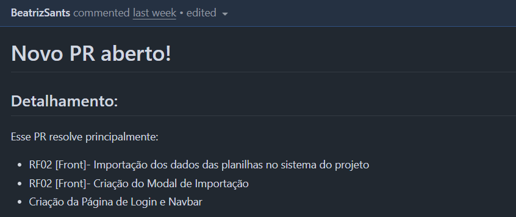

# Evidências MVP
Essa seção apresenta as evidências de implementação dos requisitos funcionais que compõem o MVP.     
### Base do Sistema
 **RF01 - Analisar Período de Estoque**    
 - Foi implementado simultaneamente com o RF07.    

 **RF02 - Integrar os dados das 4 planilhas principais**

 
 
 - No sistema 

### Consultas Diretas
 **RF03 - Consultar Produto por Código**    
 **RF04 - Consultar Produto por Linha**     
 **RF05 - Consultar Produto por Status**    

[Implementação](https://github.com/mdsreq-fga-unb/REQ-2025.2-T02-RxHospitalar/pull/157)

 **RF06 - Consultar Produto por Período de Estoque**

 [Implementação](https://github.com/mdsreq-fga-unb/REQ-2025.2-T02-RxHospitalar/pull/155)

 - No sistema   

 

### Análises Avançadas
 **RF07 - Sugerir Compras Inteligentes** 

 [Implementação](https://github.com/mdsreq-fga-unb/REQ-2025.2-T02-RxHospitalar/pull/156)

 - No sistema

 **RF08 - Consultar Principais Clientes**   
 **RF09 - Consultar Histórico de Compras por Clientes**  
 **RF10 - Consultar Performance por Vendedor**
