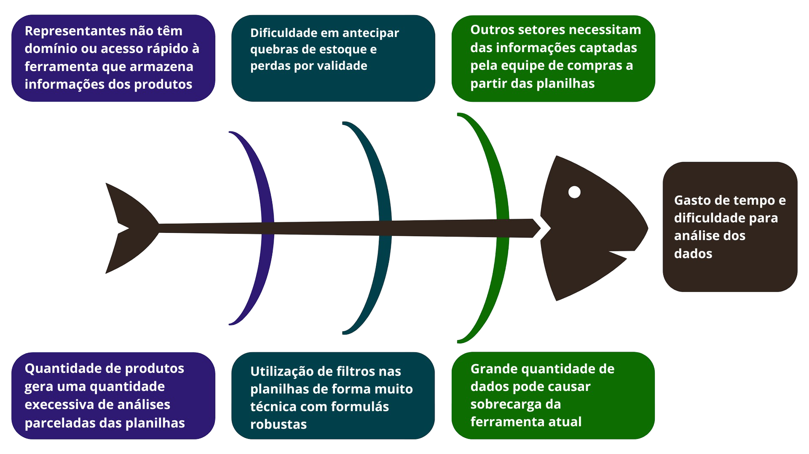

# Visão do produto e projeto 

## Cenário atual do cliente e do negócio

### 1. Introdução ao Negócio e Contexto  
A RX Hospitalar é uma empresa distribuidora de produtos médicos e oftalmológicos que atua em dois segmentos principais: o ramo de visão, com foco na comercialização de lentes de contato para óticas, e o ramo hospitalar, que envolve a distribuição de insumos e materiais cirúrgicos para hospitais, clínicas e, eventualmente, pacientes físicos. A empresa representa marcas de grande porte no setor de saúde, como Hollister, Abarth, Smith, B. Braun e Alcon, e possui abrangência em cinco estados brasileiros: Distrito Federal, Goiás, Mato Grosso, Mato Grosso do Sul e Tocantins. Com um portfólio que ultrapassa 14 mil itens apenas na área de cuidados da visão, a RX Hospitalar lida com um volume significativo de dados e transações, atendendo a mais de mil clientes entre empresas e pessoas físicas.  
Atualmente, a empresa enfrenta desafios significativos em sua operação devido à dependência de planilhas Excel para gestão de compras, estoque e vendas. Essas planilhas são atualizadas manualmente, exigindo análises demoradas e propensas a erros, especialmente considerando a grande variedade de produtos e a necessidade de acompanhar prazos de validade, sazonalidade e demandas específicas de cada cliente. Além disso, a falta de integração entre os setores e a dificuldade de visualização clara dos dados impedem tomadas de decisão ágeis e estratégicas, impactando tanto a eficiência operacional quanto a satisfação dos clientes.

### 1.2 Identificação da Oportunidade ou Problema
Durante a análise do cenário atual, foi observado que as principais dores enfrentadas pela RX Hospitalar não se limitam a apenas um único fator, mas resultam de um conjunto de causas interligadas. Para organizar e compreender melhor essas origens, foi elaborado um **Diagrama de Ishikawa**, ferramenta que auxilia na visualização das principais fontes dos problemas, como a sobrecarga no uso de planilhas, falhas de integração de sistemas e dificuldades no acesso a informações críticas. A [Figura 1](#figura-1), a seguir, apresenta essa representação de forma estruturada.

*Figura 1: Diagrama de Ishikawa.*

*Fonte: De autoria própria.*

**Principais dores:**
- Tempo elevado para compilar/atualizar bases (faturado + pendências) e analisar produto a produto.
- Risco operacional (erros de filtro/linhas ocultas, travamentos do Excel) e falta de visão unificada por linha/indústria/curva.
- Dificuldade em antecipar quebras de estoque e perdas por validade (produtos parados desde janeiro).
- Representantes sem acesso rápido a histórico por hospital/médico no campo (mobile), dependendo de repasses manuais.
- Integração limitada com ERP (sem APIs claras), exigindo importações/exportações manuais. 

### 1.3 Desafios do Projeto
#### Técnicos:
- Conectividade com Soft System/VIMAM 
    - Integração batch via arquivos / Explorar API (se possível) 
- Volume e variedade dos dados 
    - (14k SKUs no óptico; múltiplas linhas hospitalares com regras e SLA distintos).
- Modelagem de dados para histórico longo (vendas desde 2020), curva ABC por linha, políticas de estoque por indústria, controle de validade/lotes.
#### Operacionais:
- Manter sigilo (dados sensíveis de preços/condições) e governança de acesso.
- Garantir usabilidade para representantes com diferentes níveis de alfabetização digital (uso em mobile dentro do hospital).
#### Negócio:
- Respeitar exigências de estoque mínimo por indústria (ex: 90 dias) sob pena de perder condições comerciais.

### 1.4 Segmentação de Clientes
- **Principalmente B2B:**
    - Hospitais 
    - Clínicas
    - Óticas 
    - Setor público e privado
- **B2C em casos específicos:** 
    - Ex: Prótese Mamária
- **Pareto:** ≈ 20% dos clientes respondem por ~80% do faturamento da organização